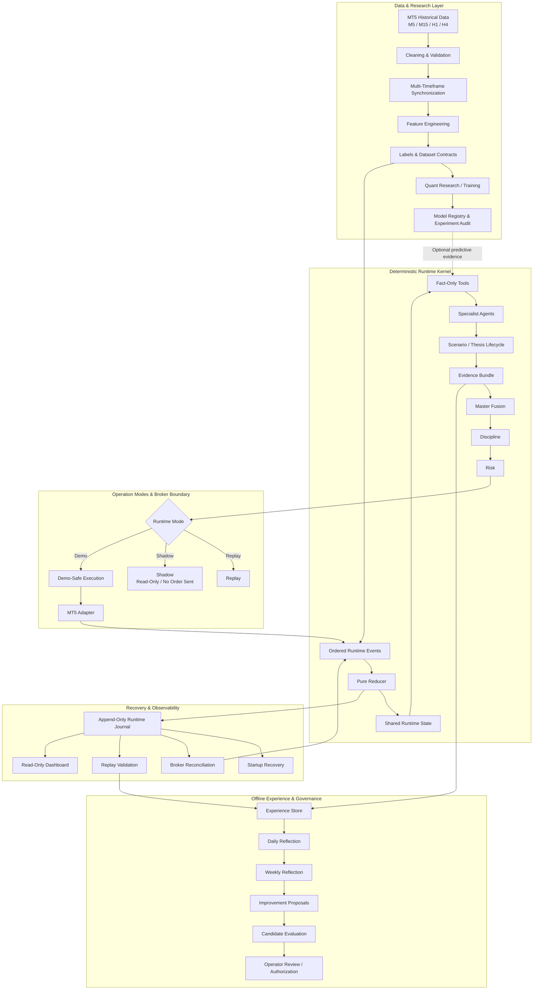
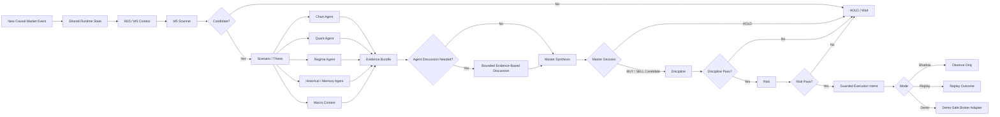
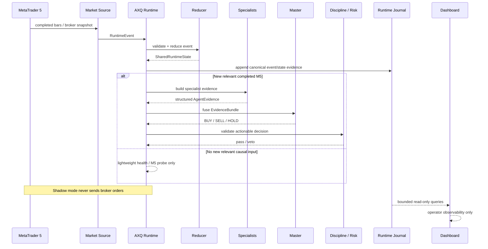

# Adaptive XAUUSD Quantitative Trading System

Local-first Python framework for developing and evaluating a measurable, tool-augmented,
multi-agent quantitative trading system for XAUUSD. It connects leakage-aware market-data and
machine-learning research workflows to deterministic runtime, replay, risk, recovery, and
read-only MT5 shadow-operation boundaries. Phases 0–8, the offline Phase 9 Task 1 reasoning
boundary, and the Phase 9 runtime stabilization baseline are checkpointed. There is no
production-trained model, autonomous strategy, live execution EA, or claim of trading
profitability.

## About

This quantitative engineering research project is designed for local experimentation with
auditable configurations, explicit causal ordering, and clearly separated data, decision, risk,
recovery, and broker boundaries.

<<<<<<< HEAD
=======

## Architecture Overview

AXQ separates research, runtime decision-making, risk, recovery, broker interaction, and offline governance into explicit boundaries. Expensive or advisory components do not directly control execution, and Shadow/Replay/Demo modes share the same deterministic runtime semantics.



The core runtime path is intentionally deterministic. Predictive ML, offline reasoning, reflection, and improvement proposals are advisory inputs or governance artifacts; none of them bypass Master, Discipline, Risk, recovery, or execution safeguards.

## Decision Pipeline

A completed market event moves through evidence construction before any execution decision is considered.



### Safety principle

No specialist agent can place an order directly.

```text
Market / Runtime Facts
        ↓
Deterministic Tools
        ↓
Specialist Evidence
        ↓
Master
        ↓
Discipline
        ↓
Risk
        ↓
Guarded Execution Boundary
```

## Live Shadow Runtime

Shadow mode uses the same decision kernel while preventing broker mutation.



### Shadow-mode guarantees

- Broker state can be observed without allowing Shadow execution.
- Startup recovery must resolve before event decisions continue.
- Runtime events remain causally ordered.
- Dashboard rendering is read-only.
- Dashboard refresh does not trigger agents, MT5 initialization, LLM calls, or feature recomputation.
- Repeated idle polling does not recompute the full decision pipeline.

>>>>>>> abd61d4 (docs: add architecture diagrams to README)
## Key Features

- Strict agent, master, risk, and execution contracts with `BUY`/`SELL`/`HOLD` semantics.
- Bounded MT5 historical downloader for XAUUSD M5/M15/H1/H4 using UTC.
- Cleaning and validation for duplicates, chronology, OHLC integrity, missing intervals, spread,
  and volume.
- Leakage-safe completed-bar M5/M15/H1/H4 synchronization with auditable availability timestamps.
- Versioned feature library covering trend, momentum, volatility, channels, volume, rolling
  statistics, DST-aware sessions, and causally delayed market structure.
- Canonical per-output feature manifests, formal warm-up/missing policies, leakage tests, and
  lightweight correlation/stability/quality diagnostics.
- Versioned direction, return, triple-barrier, and TP-before-SL labels with explicit same-bar
  ambiguity and MFE/MAE metadata.
- Immutable Parquet-oriented dataset contracts with UTC decision timestamps, feature/target
  allowlists, deterministic manifests, chronological purging/embargo, and walk-forward definitions.
- Manifest-bound Quant Agent training/evaluation/inference with majority/prior and logistic
  baselines, Random Forest plus optional XGBoost/LightGBM adapters, train-only preprocessing,
  validation-only calibration, explicit HOLD policy, metrics, explanations, and artifact hashes.
- Candidate/Challenger/Champion/Retired local registry with evidence-required manual promotion and
  a lightweight SQLite experiment audit trail.
- A separate Quant development layer with strict experiment configs, content-addressed reports,
  resumable suites and walk-forward folds, feature ablation, calibration/threshold/stability/drift
  diagnostics, compute detection, protected tuning preparation, and run comparison.
- Canonical, immutable `RuntimeEvent` and `SharedRuntimeState` contracts covering market data,
  account/equity/margin/P&L, positions, pending orders, exposure, broker constraints, freshness, and
  execution feedback without converting unknown broker values to zero.
- One implemented live-like/replay evidence path: ordered events → pure reducer → causal fact tools →
  deterministic specialists → M5/intrabar scenario lifecycle → content-addressed `EvidenceBundle`.
- Persistent `AgentMemory`, structured `AgentEvidence`, completed-M5 thesis creation, bounded
  tick/M1 confirmation or invalidation, entry-eligibility evidence, and explicit continuity status.
- An append-only SQLite runtime journal with immutable semantic records, causal/event/parent/previous
  linkage, duplicate/no-op/rejection outcomes, replay readers, and parity tests.
- Deterministic Master fusion, Discipline, financial Risk, and execution-entry contracts. The
  demo-safe execution adapter is disabled by default, idempotent by stable intent ID, explicitly
  represents unknown submissions, and returns feedback through the shared runtime reducer.
- Append-only SQLite execution recovery with exact-linkage broker reconciliation, canonical state
  refresh events, deterministic recovery anchors, and a fail-closed startup readiness gate.
- Deterministic management of already-open positions with explicit hold, monotonic protection, and
  exit-request outcomes, followed by an independent action-time safety boundary.
- Optional, lazy-loaded direct MetaTrader5 Python adapters for read-only broker snapshots, demo-only
  entries, protective-stop changes, and exact full closes. Execution is disabled by default;
  dry-run performs `order_check` without `order_send`, and there is no live-money mode.
- Deterministic end-to-end orchestration for disabled, replay, shadow, and demo operation, including
  startup reconciliation/readiness, shared decision-cycle dispatch, feedback reduction, bounded
  snapshot refresh, structured status, operator gates, and graceful restart checkpoints.
- Strict content-addressed experience contracts, exact-ID outcome attribution, a typed replay
  outcome artifact, append-only SQLite Experience Store, and descriptive experience CLI. Actual
  and counterfactual outcomes are structurally separate.
- Immutable, content-addressed Daily Reflection contracts with deterministic `available_at` UTC-day
  aggregation, explicit sample guards, append-only supersession, canonical JSON, and a concise CLI.
  Findings are descriptive observations only and cannot tune or mutate runtime policy.
- Deterministic ISO-week reflections with explicit completeness/provenance guards, evidence-backed
  success/failure observations, and an append-only pattern-status lifecycle. Aggregation creates
  only `OBSERVATION`; every later status requires an explicit operator or evaluation action.
- Immutable advisory Improvement Proposals built only from pattern keys recurring across at least
  two complete guarded weeks, with exact provenance, deterministic templates, explicit
  supersession, and an independent append-only lifecycle. `VALIDATED` is evidence status only.
- Preregistered proposal-evaluation contracts for explicitly promoted `CANDIDATE` proposals, with
  immutable candidate specs, protected Final OOS reporting, append-only evidence, and separate
  non-promoting operator decisions.
- A deterministic evaluation adapter for reviewed canonical DEVELOPMENT/VALIDATION metric samples,
  with exact artifact digests, preregistered-only computation, explicit Final OOS withholding,
  append-only execution audit, and content-stable retry reuse. It cannot tune or deploy a change.
- A governed candidate-replay boundary with one allowlisted controlled-fixture engine, exact
  proposal/candidate/plan binding, append-only replay audits, idempotent canonical Task 6 artifacts,
  and no Final OOS, parameter search, full-runtime injection, or broker path.
- A deterministic paired baseline/candidate comparison over exact canonical DEVELOPMENT/VALIDATION
  evidence. Existing preregistered criteria evaluate only the candidate; baseline values and
  decimal-safe deltas are evidence only, with fail-closed parity and Final OOS withholding.
- An append-only governed operator-review bridge over immutable paired results. Exact linear review
  histories record accept/reject/defer evidence judgments without promoting, deploying, or mutating.
- An operator-authorized proposal-transition bridge that records exact accepted-evidence permission
  for `CANDIDATE -> VALIDATED` without applying the lifecycle transition or deploying anything.
- An optional offline `REFLECTION_EXPLANATION` boundary with exact Ollama/model and code-owned
  prompt/schema identity, bounded immutable context, strict structured output, append-only SQLite
  request/response/attempt provenance, typed failure preservation, and explicit exact-result reuse.
  It is not imported by the live/replay fast path and has no policy, proposal, deployment, broker,
  MT5, or Final OOS authority.
- An optional local read-only Streamlit operator dashboard over explicit reasoning, runtime-journal,
  and replay-metrics paths. It never scans for artifacts, runs reasoning, connects to MT5, or mutates
  persisted state; unavailable fields remain visibly marked.
- SQLite WAL schema and transactional migrations, with PostgreSQL migration boundaries documented.
- Dataset manifests, label definitions, immutable model metadata, JSON logging, YAML configuration,
  and deterministic risk-veto foundation.
- Local-first defaults: offline Ollama reasoning is explicit opt-in; runtime LLM and external-news
  integrations are off.

Read [the architecture](docs/architecture.md), [agentic architecture](docs/agentic_architecture.md),
[indicator research](docs/indicator_research.md),
[feature contract](docs/features.md), [dataset contract](docs/datasets.md),
[label contract](docs/labels.md), [Quant Agent](docs/quant_agent.md),
[model training](docs/model_training.md), [model registry](docs/model_registry.md),
[runtime orchestration](docs/runtime_orchestration.md), [daily reflection](docs/daily_reflection.md),
[weekly reflection](docs/weekly_reflection.md),
[improvement proposals](docs/improvement_proposals.md),
[proposal evaluation](docs/proposal_evaluation.md),
[evaluation execution](docs/evaluation_execution.md),
[candidate replay evaluation](docs/candidate_replay_evaluation.md),
[shared-kernel candidate driver](docs/shared_kernel_candidate_driver.md),
[paired evaluation](docs/paired_evaluation.md),
[paired evaluation review](docs/paired_evaluation_review.md),
[proposal transition authorization](docs/proposal_transition_authorization.md),
[offline LLM reasoning](docs/llm_reasoning.md),
[operator dashboard](docs/operator_dashboard.md),
[live shadow runtime](docs/live_shadow_runtime.md),
and [runbook](docs/runbook.md) before running
models. The exact user-run sequence is in
[Phase 5 local runs](docs/phase5_local_runs.md).

## Tech Stack

- Python 3.12
- Pandas and NumPy
- scikit-learn
- Pydantic and PyYAML
- SQLite
- MetaTrader 5 (optional, Windows)
- Pytest, Ruff, and mypy

## Getting Started

```powershell
py -3.12 -m venv .venv
.venv\Scripts\Activate.ps1
python -m pip install --upgrade pip
python -m pip install -e ".[dev,dataset,ml,mt5]"
Copy-Item .env.example .env
python -m pytest
```

MetaTrader 5 is optional and is only required for downloading broker history on Windows.
Do not put broker credentials or API keys in tracked files.

## Lightweight Verification

```powershell
python -m pytest
python -m ruff check .
python -m mypy src/axq
python scripts/init_db.py --path runtime/smoke.sqlite3
```

These checks do not connect to a broker or run serious training. Model tests use only tiny,
deterministic temporary fits.

## Status

Framework Prototype — the local data, feature, dataset, quantitative experiment, deterministic
runtime/replay, recovery, governance, offline reasoning, dashboard, and MT5 shadow-lifecycle
components described above are implemented and regression-tested. Live-production operation and
profitability have not been validated.

## Download and validate a small sample

Start and log in to a local MT5 terminal, ensure XAUUSD history is available, then use a short UTC
interval first:

```powershell
python data/download_mt5.py --symbol XAUUSD --timeframe M5 --start 2026-08-03T00:00:00Z --end 2026-08-03T06:00:00Z --output data/raw/xauusd_m5_sample.csv
python data/clean.py --input data/raw/xauusd_m5_sample.csv --output data/processed/xauusd_m5_sample.csv
python data/validate.py --input data/processed/xauusd_m5_sample.csv --timeframe M5
python data/build_features.py --input data/processed/xauusd_m5_sample.csv --output data/processed/xauusd_m5_features.csv --config configs/base.yaml --quality-report runtime/feature-quality-smoke.json
```

Download M15/H1/H4 separately and synchronize only completed higher-timeframe bars:

```powershell
python data/synchronization.py --m5 data/processed/xauusd_m5.csv --m15 data/processed/xauusd_m15.csv --h1 data/processed/xauusd_h1.csv --h4 data/processed/xauusd_h4.csv --output data/processed/xauusd_multitimeframe.csv
```

The broker may use `XAUUSDm`, `GOLD`, or another alias. Pass the actual Market Watch symbol; store it
with the canonical XAUUSD mapping in the dataset manifest. MT5 returns only history currently
available in the terminal, so validate the requested coverage.

## Repository map

```text
configs/                 reviewable runtime, feature, label, risk, regime, master defaults
data/                    downloader and pipeline command-line entry points
database/migrations/     versioned SQLite schema
docs/                    architecture, research, runbook
src/axq/data/            reusable cleaning, validation, synchronization
src/axq/features/        versioned feature definitions and registry
src/axq/                 contracts, config, logs, database, risk, versioning, model metadata
tests/                   deterministic tiny-data tests
src/axq/agents/          Phase 6 specialist contracts, memory, scenarios, deterministic baselines
src/axq/runtime/         Phase 6 event/state/reducer/kernel/journal/replay contracts
src/axq/tools/           fact-only tools and optional predictive-model adapter
src/axq/position_management/ pure Phase 7 open-position evaluation contracts
src/axq/position_actions/ Phase 7 action-time safety, intent, and journal-chain contracts
src/axq/mt5/            optional Task 8 gateway, snapshot, demo entry, and position-action adapters
src/axq/orchestration/  Task 9 deterministic startup/event/decision/recovery composition service
src/axq/experience/     Phase 8 exact attribution, immutable experiences, store, analytics, CLI
src/axq/reflection/     Phase 8 reflections, proposals, preregistered evaluation evidence, CLI
src/axq/reasoning/      Phase 9 offline structured LLM boundary, Ollama adapter, audit store, CLI
src/axq/dashboard/      optional read-only Streamlit operator views over explicit artifact paths
src/axq/replay_validation/ shared Phase 7 replay and immutable policy composition
master/ risk/ execution/ Phase 7 integration boundaries and operator-facing documentation
datasets/                immutable Phase 3 dataset build/inspection commands
training/quant/          Phase 4 training plus Phase 5 experiment/suite/walk-forward/ablation CLIs
tuning/ evaluation/      reserved boundaries; Phase 5 tuning is explicit and never automatic
backtest/ models/        reserved for deterministic replay adapters and registered artifacts
monitoring/              reserved for health/watchdog services
```

## Non-negotiable development rules

Use chronological splits, fit preprocessing on training data only, and account for overlapping label
horizons with gaps/purging. Every feature must be available at prediction time. All model output is
advisory; deterministic risk controls and the broker adapter retain veto power. Failures block new
positions.
Serious training, large tuning, DTW indexing, image generation, and multi-year backtests are
user-run local jobs under the reviewed Phase 5 workflow.

Predictive ML is preserved as an optional `OptionalPredictiveModelTool`/Challenger input. It does
not control the runtime and is not required for V1. The isolated Phase 7 branch now extends the
Phase 6 evidence kernel through deterministic Master, Discipline, Risk, execution/recovery,
already-open position management, and the separate position-action safety boundary. Only a passed
action-time safety outcome becomes a content-addressed modify-stop or full-close intent. Task 8
supplies a direct Python/MetaTrader5 demo transport and canonical snapshot provider behind
replaceable ports. Task 9 composes these boundaries into one restart-safe service shared by replay,
shadow, and demo modes. Phase 8 reflection is offline and observational. A simulated broker,
live-money execution, MQL5/IPC transport, runtime-integrated LLM reasoning, and runtime learning
remain unimplemented. The implemented local reasoning boundary is offline and advisory only. See
[position actions](docs/position_actions.md).
The Phase 8 Shared-Kernel Candidate Driver evaluates one frozen Master-fusion configuration through
the existing system replay and emits Task 6/7 canonical metric artifacts. Its default policy set
preserves Phase 7 replay bytes; V1 has no Final OOS, tuning, broker, deployment, or proposal-
promotion path. See [shared-kernel candidate driver](docs/shared_kernel_candidate_driver.md).
Phase 8 paired evaluation compares already-produced canonical baseline/candidate evidence under the
exact stored plan. It does not rerun either side or introduce a delta acceptance rule. See
[paired evaluation](docs/paired_evaluation.md).
Task 10 appends explicit human evidence reviews without altering the paired result or proposal
lifecycle. See [paired evaluation review](docs/paired_evaluation_review.md).
Task 11 records explicit permission to request `CANDIDATE -> VALIDATED`; it does not apply that
transition. See [proposal transition authorization](docs/proposal_transition_authorization.md).
The phase implementation plans live under `docs/superpowers/plans/`.
